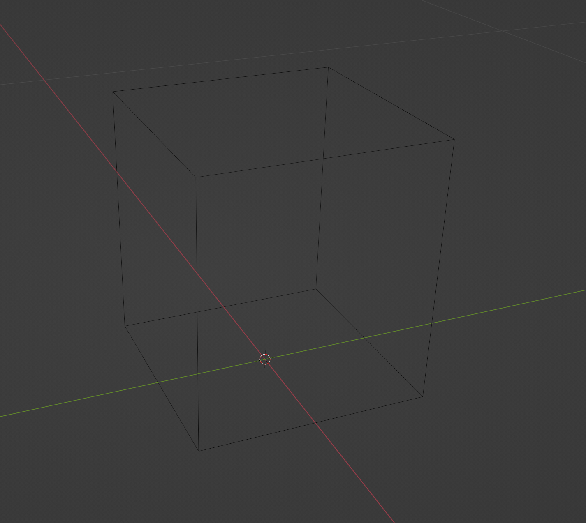

# blender-neov2-base
Base model for Creality Ender V2 NEO printing.

Just has a simple box under the outline Collection that fits the print dimensions (220×220×250mm)

Once you're done, select everything except this outline, File > Export > STL and make sure Selection Only is ticked.
That STL file can then be imported into your Slicer.

# Preview

